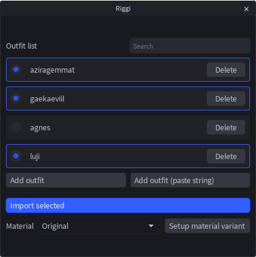

  <h1 align="center"><b>Riggi</b></h1>
  

    Roblox plugin for inserting characters. Currently only works with Perdere character saves.
     
  

  
  
  

## 📦 Installation

### Github Releases

You can install the latest `.rbxm` of the plugin
[here](https://github.com/raineyraine/riggi_plugin/releases/latest). Then, you
will have to add it as a local plugin in studio. Use `Plugins > Plugins Folder`
to find that folder:

You will likely have to reload studio to have it properly install.

### Build Manually

You can also clone the repository and run the `lute build -i` script to build
and install the plugin.

## Usage

The main interface looks like this:

Add outfits (the paste string button does not work and does nothing) with the
**Add outfit** button. This will prompt you to select `.json` or `.txt` files
containing Perdere character saves. You can select these outfits or delete them
in the list, or search your outfits. Outfits should also save between studio
sessions.

Import outfits by pressing **Import selected** (or, if no outfits are selected,
import files with **Import files**). You can set the material of accessories
using the **Material** dropdown. There are two special materials, `Original`,
which preserves the saved material (may make textureless accessories have the
`Plastic` texture), or `EntirelyBlankPlastic`, which is SmoothPlastic but
without extreme reflections. For `EntirelyBlankPlastic`, ensure you click
**Setup material variant**.

> [!NOTE]  
> If an accessory's texture is `rbxassetid://0` or `rbxassetid://1`, its
> MeshPart texture will be blank. This is done to preserve ingame appearance.

## 🗒️ License

[raineyraine/roblox-plugin-riggi](https://github.com/raineyraine/roblox-plugin-riggi)
is licensed under the
[MIT License](https://github.com/raineyraine/roblox-plugin-riggi/blob/main/LICENSE).

## 👥 Attribution

- [alicesaidhi/videkit_ty](https://github.com/alicesaidhi/videkit_ty/) MIT
  License\
  Used for plugin UI. Code is modified, since videkit_ty is not updated and
  doesn't work well with modern Vide and Luau.
- [centau/vide](https://github.com/centau/vide) MIT License\
  Used for plugin UI, core functionality, and state.
